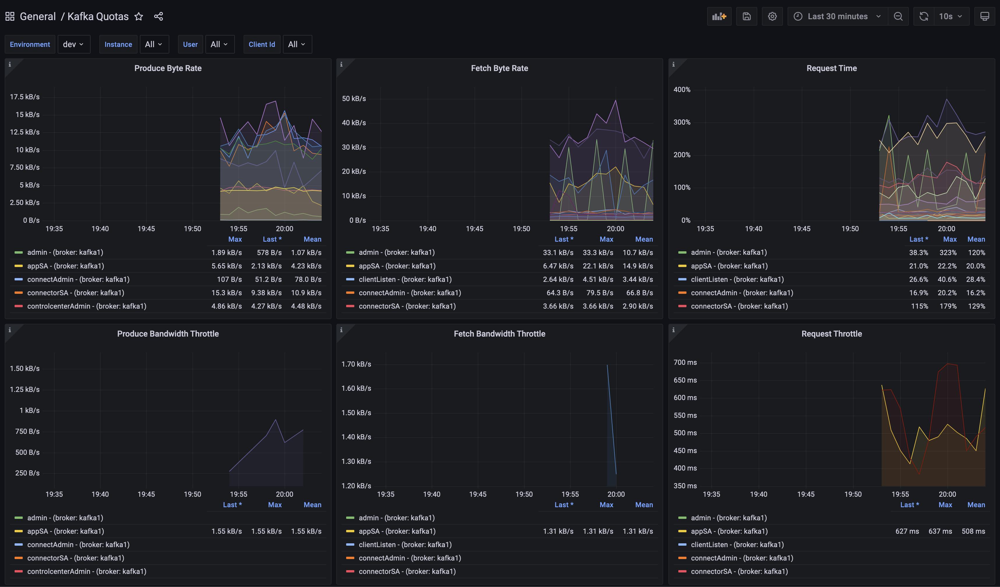

# Prometheus and Grafana stack

## Grafana dashboards

List of provided dashboards:
 - Confluent Platform overview
 - Zookeeper cluster
 - Kafka cluster
 - Kafka topics
 - Kafka quotas
 - Schema Registry cluster
 - Kafka Connect cluster
 - ksqlDB cluster
 - Kafka Clients
 - Kafka lag exporter
 - Cluster Linking
 - Kafka streams RocksDB

### Confluent Platform overview


### Zookeeper cluster


### Kafka cluster


### Kafka topics


### Kafka quotas
For Kafka to output quota metrics, at least one quota configuration is necessary.

A quota can be configured from the cp-demo folder using docker-compose:
```bash
docker-compose exec kafka1 kafka-configs --bootstrap-server kafka1:12091 --alter --add-config 'producer_byte_rate=10000,consumer_byte_rate=30000,request_percentage=0.2' --entity-type users --entity-name unknown --entity-type clients --entity-name unknown
```



### Schema Registry cluster


### Kafka Connect cluster


### ksqlDB cluster


### Kafka streams RocksDB 


### Kafka Clients


## Integration with `cp-ansible`

When deploying Confluent Platform with `cp-ansible`, Ansible inventories can be used to generate Prometheus configurations for static targets:

Ansible playbook: [cp-ansible/prometheus-config.yml](./cp-ansible/prometheus-config.yml)
Template: [cp-ansible/templates/prometheus.yml.j2](./cp-ansible/templates/prometheus.yml.j2)

Run the following commands providing a `cp-ansible` inventory:

```
ansible-playbook -i hosts.yml prometheus-config.yml
```

And a Prometheus configuration file should be generated:

```
scrape_configs:
  - job_name: "zookeeper"
    static_configs:
      - targets:
          - "zookeeper1:8079"
          - "zookeeper2:8079"
          - "zookeeper3:8079"
        labels:
          env: "dev"
    relabel_configs:
      - source_labels: [__address__]
        target_label: instance
        regex: '([^:]+)(:[0-9]+)?'
        replacement: '${1}'

  - job_name: "kafka"
    static_configs:
      - targets:
          - "kafka1:8080"
          - "kafka2:8080"
          - "kafka3:8080"
        labels:
          env: "dev"
    relabel_configs:
      - source_labels: [__address__]
        target_label: instance
        regex: '([^:]+)(:[0-9]+)?'
        replacement: '${1}'

  - job_name: "schemaregistry"
    static_configs:
      - targets:
          - "schemaregistry1:8078"
          - "schemaregistry2:8078"
        labels:
          env: "dev"
    relabel_configs:
      - source_labels: [__address__]
        target_label: instance
        regex: '([^:]+)(:[0-9]+)?'
        replacement: '${1}'

  - job_name: "connect"
    static_configs:
      - targets:
          - "connect1:8077"
          - "connect2:8077"
        labels:
          env: "dev"
    relabel_configs:
      - source_labels: [__address__]
        target_label: instance
        regex: '([^:]+)(:[0-9]+)?'
        replacement: '${1}'

  - job_name: "ksqldb"
    static_configs:
      - targets:
          - "ksqldbserver1:8077"
          - "ksqldbserver2:8077"
        labels:
          env: "dev"
    relabel_configs:
      - source_labels: [__address__]
        target_label: instance
        regex: '([^:]+)(:[0-9]+)?'
        replacement: '${1}'
```

This configuration can be added to the Prometheus config file.
Once Prometheus is restarted with this configuration, targets will be scrapped.